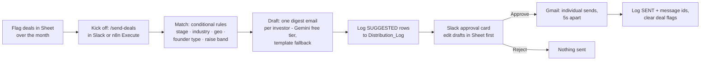

# District Angels — Deals Recommendation & Distribution

Flag compelling deals in a Google Sheet; once a month (or whenever you're ready)
kick off one n8n workflow that matches them to the right member investors with
plain conditional rules, drafts one personalized digest email per investor with
a free-tier LLM, asks for approval in Slack, sends via Gmail, and logs exactly
who got what. **Incremental cost: $0/month.**

## How it works

1. **Flag** — add deals to the `Deals` tab as they come in and tick
   `include_in_next_send`. Nothing runs until you kick off.
2. **Kick off** — POST to the workflow's webhook (wire it to a `/send-deals`
   Slack slash command, see setup) or press **Execute workflow** in n8n.
3. **Match** — pure conditional logic in [`scripts/match_rules.js`](scripts/match_rules.js)
   (embedded in the workflow's *Match Investors* Code node). An investor gets a
   deal only if **every** applicable rule passes:
   - is an `investor` with a valid email, not do-not-contact / unsubscribed
   - hasn't already received this deal (checked against `Distribution_Log`)
   - stage prefs contain the deal's stage (blank or `any` = all stages)
   - ≥ 1 industry overlap (blank investor list = generalist)
   - geography overlaps when both sides specify one
   - founder-type interests overlap when both sides tag one
   - deal raise falls inside the investor's `min_check`–`max_check` band, if set
   Vocabulary is normalized (case/spacing/hyphens + an alias map in `Config`),
   and every exclusion is counted with a reason so bad data surfaces in Slack.
4. **Draft** — one Gemini Flash free-tier call per 4 investors writes each
   digest (personal opener, a short block per deal including your
   `why_compelling` note and deck link, soft CTA). If the LLM errors or is
   rate-limited, those investors get a clean plain-text template instead — a
   cycle never blocks. The prompt lives in [`prompts/digest_email.md`](prompts/digest_email.md).
5. **Approve** — n8n appends one `SUGGESTED` row per (deal, investor) to
   `Distribution_Log`, then posts a summary card to Slack with
   **Approve / Reject** buttons. Before approving you can, directly in the Sheet:
   untick `include` on any pair, or edit any `digest_subject` / `digest_body`.
   The send step re-reads the Sheet, so your edits always win.
6. **Send & track** — Gmail sends one personalized email per investor
   (individual `To:`, 5 seconds apart — better deliverability than BCC, and it
   reads as curated, not a blast). Rows flip to `SENT` with timestamp and Gmail
   message id; deal flags clear; Slack gets a confirmation.
   `Distribution_Log` is the permanent who-got-what record.

## Repo layout

| path | what it is |
|---|---|
| `sheets/schema.md` | the Google Sheet spec — 4 tabs with copy-paste header rows |
| `scripts/match_rules.js` | the matching engine (zero deps; also embedded in the workflow) |
| `test/match_rules.test.js` | tests — run `node --test test/*.test.js` |
| `workflows/deal-send-cycle.json` | the n8n workflow, importable |
| `prompts/digest_email.md` | canonical LLM prompt + template fallback |

## One-time setup (~30 minutes)

### 1. The Google Sheet
Create a spreadsheet with four tabs — `Contacts`, `Deals`, `Distribution_Log`,
`Config` — using the exact header rows in [`sheets/schema.md`](sheets/schema.md).
Fill `Config` (sender name, signature, alias map) and paste in your investor
contacts. Start with ~30 contacts; you can consolidate the rest later.

### 2. n8n
Import `workflows/deal-send-cycle.json` (Workflows → Import from file), then:
- Replace `YOUR_SPREADSHEET_ID` in every Google Sheets node (or re-pick the
  spreadsheet from the dropdown once credentials are attached).
- Attach credentials: **Google Sheets** (OAuth), **Gmail** (OAuth — the account
  the emails send from), **Slack** (bot token with `chat:write`, invited to
  your review channel), and an **HTTP Header Auth** credential for Gemini —
  header name `X-goog-api-key`, value = a free API key from
  [Google AI Studio](https://aistudio.google.com/apikey).
- Point the Slack nodes at your review channel (default `#deal-review`).
- Activate the workflow and copy the production webhook URL.

> **Slack approval buttons and the webhook trigger require your n8n instance to
> be reachable from the internet** (n8n Cloud: automatic; self-hosted: needs a
> public URL). If yours isn't, trigger with the Execute button and replace the
> *Slack — Approve Cycle* node with a plain message + a manual second workflow —
> ask and we'll add that variant.

### 3. The `/send-deals` slash command (optional but nice)
In [api.slack.com/apps](https://api.slack.com/apps) → your app → Slash
Commands → create `/send-deals` with the Request URL set to the workflow's
production webhook URL. Anyone in the workspace can then kick off a cycle from
Slack.

### 4. LLM fallback (optional)
If Gemini's free tier gets rate-limited mid-cycle, disable the Gemini node and
enable the pre-wired **Groq** node (free key from console.groq.com; HTTP Header
Auth: `Authorization` / `Bearer <key>`). The parser understands both response
shapes; anyone still missing a draft gets the plain template.

## First run — safe checklist (~10 minutes)

1. Add one **test deal** and set your own email up as a test investor contact.
2. **Disable the *Send Digest* (Gmail) node**, run the workflow, and check:
   the Slack card appears, `Distribution_Log` has sensible `SUGGESTED` rows and
   draft text, exclusion counts look right.
3. Edit a draft in the Sheet, re-run, confirm the edit is honored.
4. Re-enable Gmail, run a real cycle to 2–3 friendly members first.

## Costs & limits

- Gemini Flash free tier: a cycle uses ~1 request per 4 investors — a
  50-investor send is ~13 requests, far under free-tier daily quotas.
- Gmail: personal accounts allow ~500 recipients/day; keep cycles under ~100
  emails and the 5s spacing handles the rest. If members mark emails as spam,
  sender reputation dies fast — honor `unsubscribed_deals` religiously.
  Longer term, send from a Google Workspace address (e.g. `deals@…`).
- **Privacy**: free LLM tiers may use prompt data for product improvement. The
  workflow deliberately sends the LLM only first names, interests, and deal
  facts — never email addresses, check sizes, or notes. To remove even that,
  switch to Groq (no-training default) or paid Gemini (~pennies/month).

## Deferred (planned, not built yet)

- **Supabase auto-sync** — n8n workflow mirroring Contacts / Deals /
  Distribution_Log into Supabase (`contacts`, `deals`, `deal_contacts`) after
  each send + nightly, making Supabase the durable auto-updating CRM.
- Apps Script import helpers for consolidating Tally exports / legacy sheets
  into the Contacts tab (dedupe by email, normalize industries).
- Error-alert workflow (n8n Error Trigger → Slack DM).
- Non-webhook approval variant for NAT'd self-hosted n8n.
- CI (`node --test` on push) and data-validation dropdowns on enum columns.
