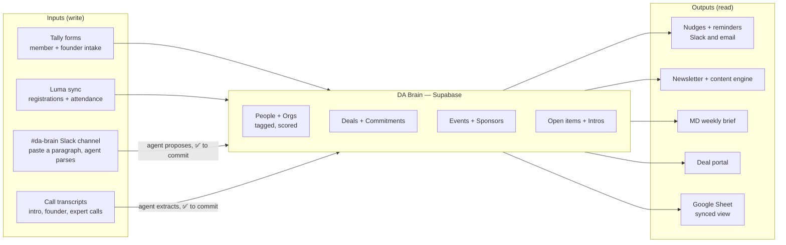
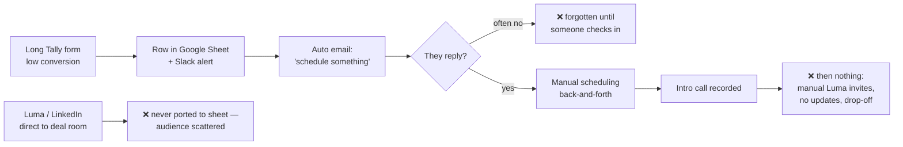
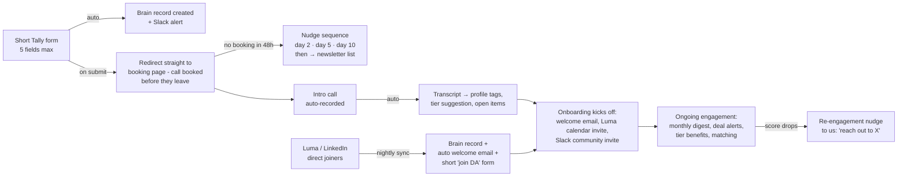
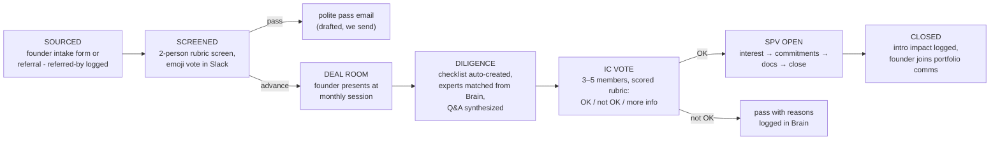
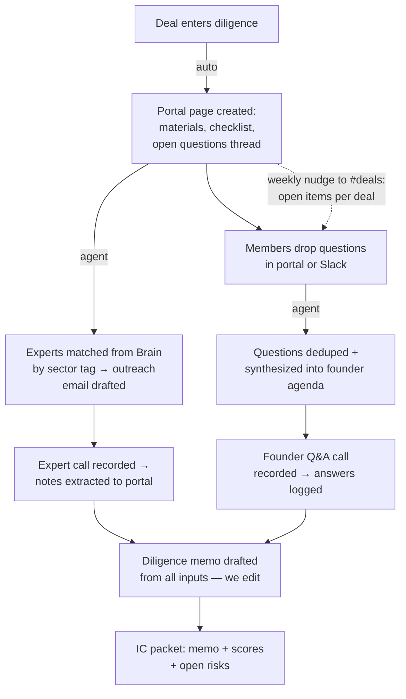
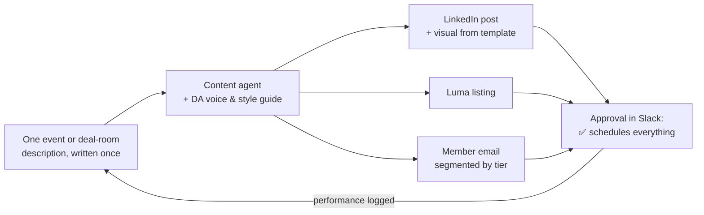
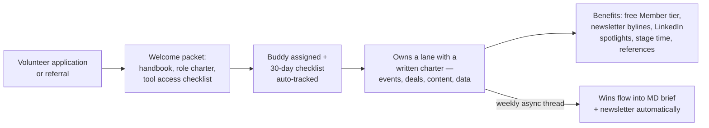
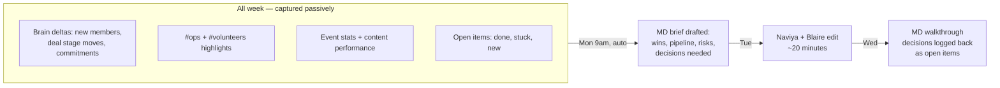

# The District Angels Operating System

End-to-end documentation of how deals, events, members, communications, marketing, volunteers, and investments flow through District Angels — the fragmented state today, and the automated system we are building toward.

> **Operating principle:** one source of truth (the DA Brain), Slack as the control surface, email and Luma as distribution. Agents draft, log, and nudge; humans approve and decide. Nothing depends on someone remembering.

Every step below is marked by mode:

- 🔴 **Manual today** — the failure points
- 🟢 **Automated** — runs without us
- 🟡 **Human-approved** — agent drafts, we sign off

---

## 01 · Where the system breaks today

Every DA workflow works — once — because someone remembers to push it. The common failure mode is not bad process, it's **manual dependencies with no fallback**.

| Domain | Pain |
| --- | --- |
| Members | Long Tally form → low conversion. Auto-email asks them to schedule → they forget, we forget. After the intro call: nothing — manual Luma invites, no updates, quiet drop-off. |
| Members | Second front door: people join the deal room directly via Luma/LinkedIn and never get ported to the sheet. Audience scattered across tools. |
| Deals | Founders invited manually, diligence manual, calls ad hoc, questions ad hoc, expert chats over email, synthesis ad hoc. No IC. No single portal. |
| Deals | No way for members to mark interest on a deal or discuss why they're in/out. SPV commitments untracked. Referrals/intros untracked. |
| Data | Contacts untagged; preferences live in our heads. Transcripts recorded, then go nowhere. |
| Comms | Open items drown in Slack flood and unread email. Nothing tracks what's still open. |
| Marketing | Newsletter died of manual sourcing + drafting. Deal room has no cadence — happens when Naviya remembers. |
| Partners | Sponsor asks and owed benefits untracked; kickbacks and reminders don't happen. Cohost selection runs on memory. |
| Team | Volunteers get no onboarding, few benefits, little visibility. MD updates require chasing bullets into a sheet every Wednesday. |

---

## 02 · The DA Brain — one source of truth

Every fix downstream depends on this: a single database (**Supabase**) that every tool writes into and every automation reads from. Google Sheets survives as a synced **view** for comfort — not the record. Writing to the Brain must be easier than not writing to it: four input surfaces, three automatic.

### What the Brain stores

| Object | Holds | Feeds |
| --- | --- | --- |
| **People** | Contact info, type (angel / founder / operator / expert / sponsor / volunteer / embassy / friend-of-DA), sector interests, check size, stage focus, offers-in-kind, source, engagement score | Segmented comms, expert matching, member matching, cohost selection |
| **Deals** | Stage, founder, materials, open questions, diligence checklist, expert notes, IC votes, referred-by | Deal portal, nudges, IC packet, referral impact reports |
| **Commitments** | Per-member per-deal interest: committed / interested / watching / pass + why, SPV doc status | SPV threshold alerts, unsigned-doc nudges |
| **Events** | Cadence, T-minus checklist state, registrations, attendance, recap status | Content engine, post-event automation, engagement scoring |
| **Sponsorships** | Sponsor asks, owed benefits, deliverables per event, renewal dates | Pre-event benefit reminders, quarterly sponsor reviews |
| **Intros & referrals** | Who introduced whom to what, outcome | Impact reporting, cohost and expert track records |
| **Open items** | Every task with owner + due date, extracted from Slack and calls | Mon/Thu open-items digest, MD brief |

### The four input surfaces

| Surface | How it writes | Mode |
| --- | --- | --- |
| Tally forms | Webhook → Brain on every submission (member intake, founder intake, matching survey, volunteer application) | 🟢 Auto |
| Luma | Nightly API sync pulls every registration and attendance into People + Events — ends the manual porting problem | 🟢 Auto |
| #da-brain channel | Paste free text ("met Sara at the mixer, ex-Stripe, angels in fintech, $10–25k checks, happy to host") → agent parses into a structured update → react ✅ to commit | 🟡 Approve |
| Call transcripts | Recorder (Fathom/Fireflies) joins every call → agent extracts facts, preferences, open items → same ✅ flow in #da-brain | 🟡 Approve |

**One-time lift:** a tagging backfill sprint on existing contacts — export current sheet, agent proposes tags per row, team confirms in batches. After that, tags only accrete automatically.

---

## 03 · Member lifecycle — from stranger to engaged angel

Two fixes carry this flow: **collapse form → schedule into one step** (no email ping-pong), and **make follow-through automatic** (nudges, Luma invites, updates). Both front doors merge into one funnel.

### Today — every hand-off is a drop-off point

### Target — one funnel, zero memory required

### Membership tiers — clear expectations, clear benefits

| Tier | Who | Gets |
| --- | --- | --- |
| **Community** (free) | Newsletter signups, deal-room walk-ins, embassy audiences | Monthly newsletter, public events, deal room as guest (announcements only) |
| **Member** (paid annual) | Vetted angels and operators who complete the intro call | Full deal room + memos, portal access, member-only dinners and activations, matching, priority seats |
| **Charter** (higher / invite) | Most active investors, IC members | Everything above + SPV priority allocation, IC eligibility, embassy dinners, concierge intros, visibility as DA leadership |

- **Engagement score** (attended, opened, committed, referred) lives on every People record — drives re-engagement nudges and flags Charter candidates.
- **Volunteers get Member benefits free** — the first concrete perk of the volunteer program.
- **Member matching:** opt-in survey (interests, personality, goals) → monthly agent-proposed pairings → we glance and approve → double-opt-in intro email → feedback closes the loop.

---

## 04 · The deal engine — sourced to signed

Deals get a defined pipeline with stage gates, one portal as the container for everything, an investment committee that formally OKs deals, and automated nudges so open items never stall.

### Inside diligence — the part that's fully ad hoc today

### Member engagement per deal

- **Interest marking:** every deal email and portal page carries four buttons — *Committed / Interested / Watching / Pass* — one click writes to the Brain. Pass asks one optional question: why?
- **Private discussion** lives in the portal (not WhatsApp) so privacy holds and reasoning is preserved. Interested members get thread digests by email.
- **Right-time engagement:** members are pinged per deal exactly three times — deal room invite, diligence summary + interest ask, SPV open. Interested members get more; everyone else isn't spammed.
- **SPV flow:** committed interest crosses threshold → spin up SPV (Sydecar/AngelList) → Brain tracks doc status per member with unsigned-doc nudges.
- **Referral tracking:** every deal and intro records *referred-by* → quarterly intro-impact report — the dataset cohost and embassy conversations have been missing.

---

## 05 · Events & the content engine

Cadence stops being memory-dependent: the calendar owns it. Every event auto-creates its own T-minus checklist, and one description fans out into every channel in DA's voice.

**Fixed cadence:** Virtual Deal Room — second Wednesday monthly · Member-only activation — quarterly · Newsletter — last Thursday monthly.

### The T-minus checklist — created automatically per event

| When | What happens | Mode |
| --- | --- | --- |
| T-21 | Event created from template in Luma; founder/speaker confirmed; sponsor benefit checklist attached | 🟡 Approve |
| T-14 | Content engine fans out: LinkedIn post, Luma listing, member email — drafted in DA voice, approved in Slack, scheduled | 🟡 Approve |
| T-7 | Second push to non-registered segments; reminder to registrants | 🟢 Auto |
| T-1 | Reminder email + Slack; run-of-show to team; sponsor deliverables double-checked by bot | 🟢 Auto |
| T+1 | Attendance synced from Luma; recap email drafted from transcript; thank-yous drafted for cohost, sponsors, speakers | 🟡 Approve |
| T+3 | New contacts tagged into the Brain; no-shows get recap + next date; engagement scores updated | 🟢 Auto |

### Newsletter that writes itself first

The month's raw material already lives in the Brain — deals moved, events held, new members, member wins parsed from #da-brain — so an agent assembles the draft on the last Monday, the team edits for 30 minutes, it ships Thursday.

- **Email budget:** members receive at most 4 emails a month — newsletter, deal alert, event invite, recap. The content calendar enforces it.
- **Cohost selection from data:** orgs in the Brain carry audience, sector, and past-event performance — "who should cohost a fintech deal room?" becomes a query, not a memory exercise.

---

## 06 · Communications — who hears what, where

The rule that fixes the flood: **Slack is a notification surface, never a storage layer.** Everything actionable becomes an open item in the Brain with an owner and a date; the bot replays what's open twice a week.

| Audience | Channel | Cadence & content |
| --- | --- | --- |
| Core team | Slack #ops, #deals, #da-brain | Real-time; open-items digest Mon + Thu |
| Volunteers | Slack #volunteers | Weekly async update thread (replaces the sheet); wins surface into MD brief + newsletter |
| Members | Email (primary) + member community space | Max 4 emails/month; deal pings only to interested members; portal digests |
| Founders in pipeline | Email + portal | Stage-triggered: confirmation, logistics, diligence requests, decision |
| Sponsors & partners | Email + quarterly review | Pre-event benefit confirmations, post-event proof, renewal reminders |
| Community / public | LinkedIn + Luma + newsletter | Content-engine output on the fixed calendar |

Open items enter the Brain automatically from three directions: transcript action items, #da-brain parsing, and checklist items spawned by deal stages and event T-minus clocks. Each has an owner and a due date or it doesn't exist.

---

## 07 · Sponsors, in-kind supporters, volunteers, embassies

### Sponsors — commitments that keep themselves

- Every sponsorship is a Brain record: asks, owed benefits, deliverables per event, renewal date.
- Before each event the bot posts the sponsor checklist to #ops ("Sponsor X is owed logo on deck, 3-min stage moment, LinkedIn mention"). After: proof-of-delivery auto-compiled into a sponsor recap email.
- Quarterly sponsor review drafted from the record — renewals start from receipts, not recollection.

### In-kind supporters — the third audience

People who aren't investors and aren't founders still carry value: venues, legal, design, speaking, mentoring, event sponsorship. They get an *offers* tag set in the Brain; needs become queries against offers. A standing "support DA" form feeds the same records.

### Volunteers — a real onboarding, real benefits

### Embassies — staged for later

Not yet activated, and the system is built for it: embassies enter the Brain as orgs, their foreign-national audiences as a Community-tier segment. When activation starts (Phase 3+), embassy dinners slot into the Charter tier and the events cadence — no new machinery needed.

---

## 08 · The weekly rhythm — MD updates without the chase

Today: volunteers fill a sheet, Naviya and Blaire pull bullets from it, walk through it Wednesday. Target: the week reports itself; humans edit and decide.

| Day | What fires | Mode |
| --- | --- | --- |
| Monday | Open-items digest to #ops · MD brief drafted from prior week | 🟢 Auto |
| Tuesday | Naviya + Blaire edit the brief; decisions queued | 🟡 Approve |
| Wednesday | MD walkthrough; outcomes logged as open items with owners | 🟡 Approve |
| Thursday | Second open-items digest; stuck items escalated by age | 🟢 Auto |
| 2nd Wednesday | Virtual Deal Room (cadence owned by calendar, not memory) | 🟢 Auto |
| Last Mon → Thu | Newsletter drafts itself Monday, edited midweek, ships Thursday | 🟡 Approve |

---

## 09 · The stack — keep what works, add the glue

| Layer | Tool | Status | Role |
| --- | --- | --- | --- |
| Intake | Tally | keep | All forms, webhooked into the Brain |
| Scheduling | Cal.com or Calendly | add | Embedded straight after form submit |
| Database | Supabase | add | The Brain; Google Sheets stays as synced read view |
| Glue | n8n (or Zapier / Make) | add | Webhooks, Luma sync, nudges, T-minus clocks, digests |
| Agents | Claude API | add | #da-brain parsing, transcript extraction, content engine, newsletter, MD brief, memo drafts — always draft-then-approve for anything outbound |
| Transcripts | Fathom / Fireflies | add | Joins every call; feeds extraction |
| Events | Luma | keep | Registration + attendance, synced nightly via API |
| Member email | Beehiiv or Loops | add | Newsletter + segmented sends with the 4-email budget |
| Portal | Notion (v1) → Supabase-backed portal (v2) | add | One home per deal; start with Notion, graduate when it hurts |
| SPV | Sydecar or AngelList | add | Entity, docs, wires; doc status mirrored into Commitments |
| Team comms | Slack | keep | The control surface: alerts, ✅ approvals, digests, #da-brain |

---

## 10 · Roadmap — four phases, each one self-funding

Ordered by leverage: stop losing leads first, build the Brain second, automate the engines third, launch the compounding programs fourth. Each phase works even if the next never ships.

### Phase 0 — Stop the bleeding (weeks 1–2)
- Cut the intake form to 5 fields; redirect straight into a booking page on submit
- Turn on the 48h / day-5 / day-10 nudge sequence for unbooked leads
- Fix the deal-room cadence: second Wednesday, recurring, on the calendar
- Adopt the comms matrix and email budget; decide tier names and pricing on paper

### Phase 1 — One Brain (weeks 3–6)
- Supabase schema (People, Deals, Events, Commitments, Sponsorships, Open items) + Sheet view
- Tally webhooks and nightly Luma sync — the scattered-audience problem ends here
- #da-brain channel with the parse-and-✅ agent; recorder on all calls with extraction
- Tagging backfill sprint on existing contacts; open-items digest live Mon/Thu

### Phase 2 — The engines (weeks 7–12)
- Deal pipeline stages + Notion portal v1; founder intake form; screening rubric
- Diligence automation: auto checklists, expert matching, question synthesis, memo drafts
- Content engine (description → LinkedIn + Luma + email) with Slack approval
- T-minus event checklists, post-event recap/thanks automation, sponsor tracker + reminders
- MD brief auto-drafted Mondays; newsletter restarts on the monthly cadence

### Phase 3 — Compounding (quarter 2)
- Launch paid tiers with member-only activations; migrate existing members
- Formalize the IC (3–5 members, rubric, logged votes); per-deal interest buttons + portal discussion
- SPV interest → threshold → spin-up flow with doc-status nudges
- Member matching survey + monthly pairings; volunteer program v1 with benefits
- Referral / intro tracking with the quarterly impact report

### Phase 4 — Horizon (later)
- Embassy activation: foreign-national audiences as a Community segment, embassy dinners at Charter tier
- Proprietary dataset: the Brain has quietly been building it — deals seen, member preferences, intro outcomes — package it when dense enough
- Portal v2: custom Supabase-backed member portal replacing Notion

---

*District Angels · Operating System v1 · July 2026 · Working draft — pressure-test every flow against a real week before automating it.*
